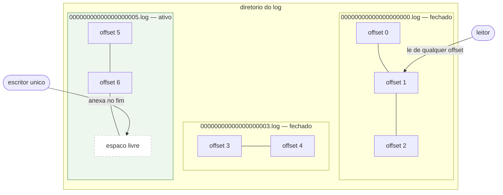
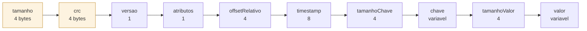

# 01 — Anatomia do log

Um log e um diretorio de arquivos de segmento. Cada segmento e uma sequencia de
registros concatenados. Um unico segmento esta aberto para escrita — o **ativo**;
os demais estao fechados e sao imutaveis.

Na fase 1 existe apenas o segmento `00000000000000000000.log`. A segmentacao
entra na fase 2 sem mudar a API publica.

## Registro por dentro

Os dois campos destacados sao os unicos que a leitura consulta antes de confiar em
qualquer byte: `tamanho` diz onde o registro termina, `crc` diz se ele chegou
inteiro. Tudo a partir de `versao` esta coberto pelo CRC.

## Invariantes

| Invariante | Por que importa |
|---|---|
| Offset e monotonico e sem lacuna | um leitor sabe que `n+1` vem depois de `n` sem consultar indice |
| Segmento fechado nunca muda | leitor de segmento fechado nao precisa se coordenar com o escritor |
| Escrita so acontece no fim do segmento ativo | nao existe atualizacao em lugar, entao nao existe registro meio-escrito no meio do arquivo |
| Nenhuma leitura passa do limite legivel | o limite so avanca depois de um registro inteiro no disco, entao leitor concorrente nunca ve meio registro |
