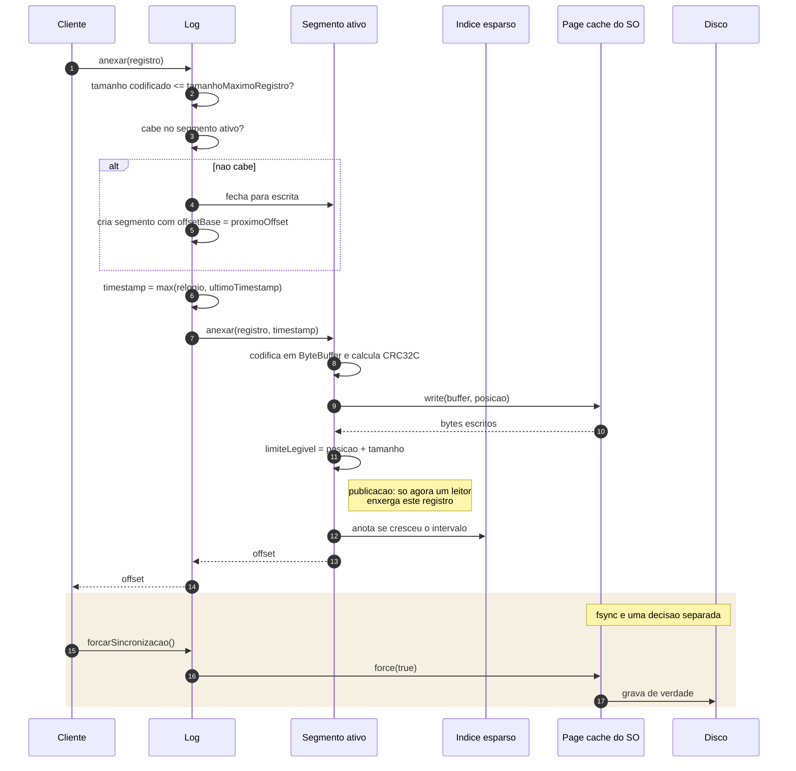

# 02 — O caminho de um append

## O que a ordem dos passos garante

A escrita completa **antes** de `limiteLegivel` avancar. Como nenhum leitor le
alem desse limite, nao existe janela em que um leitor veja meio registro. Nao ha
lock entre writer e leitores; ha uma unica escrita `volatile` que publica o
trabalho ja terminado.

A entrada de indice e anotada **depois** da publicacao. Se o processo cair entre
as duas coisas, o indice fica sem uma entrada — e o segmento continua correto,
porque o indice e so uma dica.

## O que ainda nao esta aqui

`anexar` retorna assim que o `write` volta, ou seja, quando os bytes estao no page
cache do sistema operacional — nao no disco. Isso significa que **o registro
sobrevive a uma queda do processo, mas nao a uma queda do sistema operacional**,
a menos que `forcarSincronizacao` tenha sido chamado.

Os tres modos de durabilidade — `ACadaAppend`, `PorIntervalo`, `Nenhum` — e a
garantia exata de cada um entram na fase 3, com o diagrama de recuperacao.
