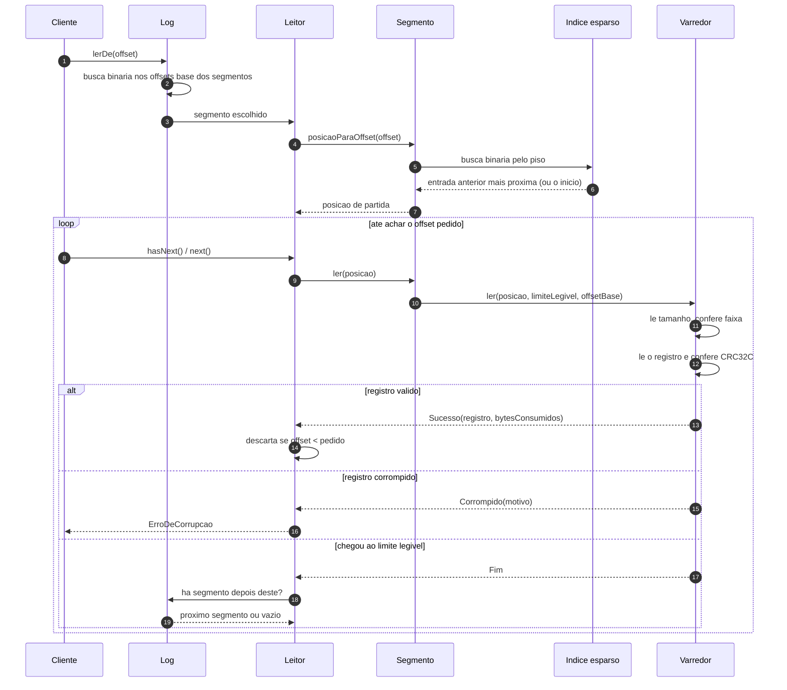

# 03 — O caminho de uma leitura

## Por que o indice e esparso, e nao denso

A pergunta que o indice responde nao e "onde esta o offset N", e sim **"de onde
posso comecar a varrer sem risco de passar do offset N"**. Essas duas perguntas
tem custos muito diferentes.

Um indice denso — uma entrada por registro — responde a primeira em tempo
constante e cobra espaco proporcional ao numero de registros. Um segmento de
64 MiB com registros de 100 bytes teria 670 mil entradas.

O indice esparso responde a segunda com uma entrada a cada 4 KiB. A busca binaria
para na entrada anterior, e a varredura cobre no maximo esses 4 KiB — que o
sistema operacional entrega numa leitura so, quase sempre do page cache. O
resultado pratico e o mesmo, com 1/40 do espaco.

Detalhe que costuma passar batido: **o indice nunca decide o que a leitura
devolve**. Ele so decide de onde ela comeca. Uma entrada perdida, um indice
apagado ou um arquivo truncado deixam a leitura mais lenta e igualmente correta.
E por isso que ele nao tem CRC e nao participa do fsync.

## Leitura por tempo

`primeiroOffsetDesde(instante)` percorre os segmentos em ordem e, dentro de cada
um, usa a mesma entrada de indice — desta vez comparando por `timestamp` — para
achar o ponto de partida e varrer ate o primeiro registro com timestamp maior ou
igual ao pedido. Funciona porque o timestamp gravado e nao-decrescente
([ADR 0005](../adr/0005-timestamp-nao-decrescente.md)).
