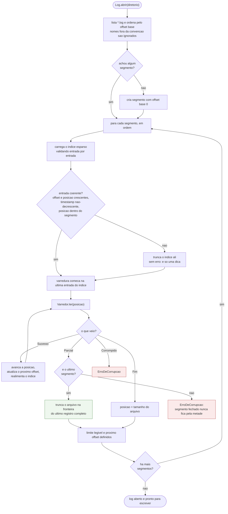

# 04 — O que acontece na abertura depois de uma queda

## As tres decisoes que esse fluxo toma

**Parcial nao e corrupcao.** Um registro cortado no meio, no fim do ultimo
segmento, e o rastro esperado de uma queda no meio de um append. A resposta e
truncar e seguir — nao ha nada de errado com o log. Um registro cortado em
qualquer outro lugar e corrupcao, porque nao existe caminho de codigo que
produza isso.

**Truncar e obrigatorio, nao opcional.** Se os bytes parciais ficassem no disco, o
proximo append escreveria por cima do inicio deles; se o registro novo fosse
menor, sobraria uma cauda de lixo que a leitura seguinte interpretaria como
registro. Escrita parcial viraria corrupcao. Isso e verificado em toda posicao de
corte possivel — no arquivo unico e no ultimo segmento de um log com varios.

**A varredura comeca no indice, nao no inicio.** Abrir um log de 10 GB custa o
mesmo que abrir um de 10 MB: no maximo um intervalo de indice e varrido. O preco
esta declarado: corrupcao num registro anterior a esse ponto nao aparece na
abertura — ela aparece quando aquele registro for lido, que e onde o CRC e
conferido. A garantia e a mesma; o momento e outro.

## O caso da queda durante a rolagem

Rolar um segmento cria um arquivo novo e vazio. Se a queda acontecer entre criar o
arquivo e escrever o primeiro registro nele, a abertura encontra um segmento vazio
no fim — e isso e legitimo: `Fim` na primeira posicao, offset seguinte igual ao
offset base. O log abre, e o proximo append usa esse mesmo segmento. Prova:
`RecuperacaoComSegmentosTest#deveAbrirNormalmenteQuandoAQuedaAconteceuEntreCriarESegmentoEEscreverNele`.
