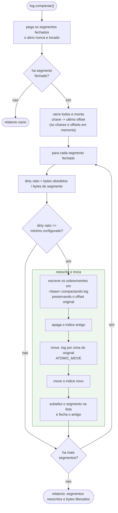
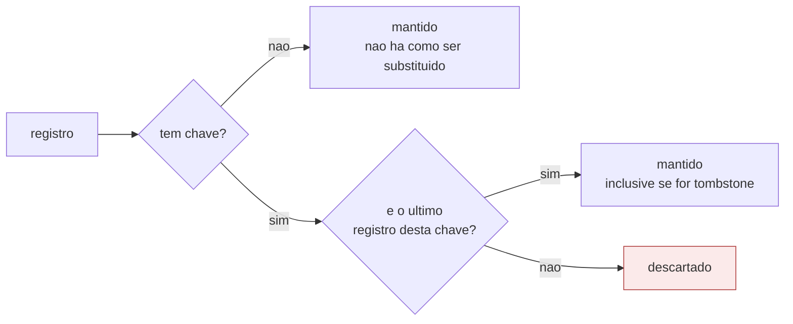

# 05 — Compactacao por chave



## Quem sobrevive a compactacao



## Antes e depois

```
antes    offset: 0    1    2    3    4    5    6
         chave:  a    b    a    c    a    b    d
                 v1   v1   v2   v1   v3   tomb v1

depois   offset: 3    4    5    6
         chave:  c    a    b    d
                 v1   v3   tomb v1
```

Repare em duas coisas. Os offsets **nao foram renumerados**: 0, 1 e 2 sumiram e
viraram lacunas. E o tombstone da chave `b` continua la, ocupando espaco, porque
ele e a unica coisa que conta para um leitor atrasado que a chave `b` foi
removida.

## Dirty ratio e quando compensa

Compactar um segmento custa uma leitura e uma escrita do segmento inteiro. Se so
5% dos bytes estao obsoletos, esse custo compra 5% de espaco — nao compensa.

O `dirtyRatioMinimo` (0,5 por padrao) e o botao que decide isso: um segmento so e
reescrito quando pelo menos metade dos seus bytes ja foi substituida por escritas
posteriores. Segmentos de dados que quase nunca mudam ficam intocados para sempre,
que e exatamente o que se quer.

O calculo do dirty ratio precisa do mapa de chave para ultimo offset **de todos os
segmentos fechados**, porque uma chave escrita no segmento 1 pode ter sido
substituida no segmento 9. Por isso o mapa e montado antes de decidir qualquer
coisa.

## A ordem da troca

O passo "apaga o indice antigo" vem **antes** do move do segmento, e essa ordem
nao e detalhe. Se a queda acontecer no meio, sobra um segmento novo sem indice —
que a abertura reconstroi varrendo, sem erro. A ordem inversa deixaria um indice
velho apontando para posicoes que nao sao mais inicio de registro, e a varredura
a partir dali acusaria corrupcao num arquivo perfeitamente intacto.

Leitores em andamento sobrevivem porque o `move` troca a entrada de diretorio e o
arquivo antigo continua vivo enquanto houver descritor aberto. Quando o segmento
antigo e fechado, o leitor recebe o erro do canal, se reposiciona pelo proximo
offset que esperava e continua no arquivo novo — podendo, claro, nao ver mais os
registros que a compactacao removeu.
